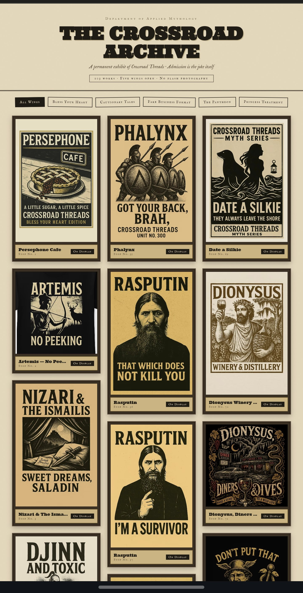
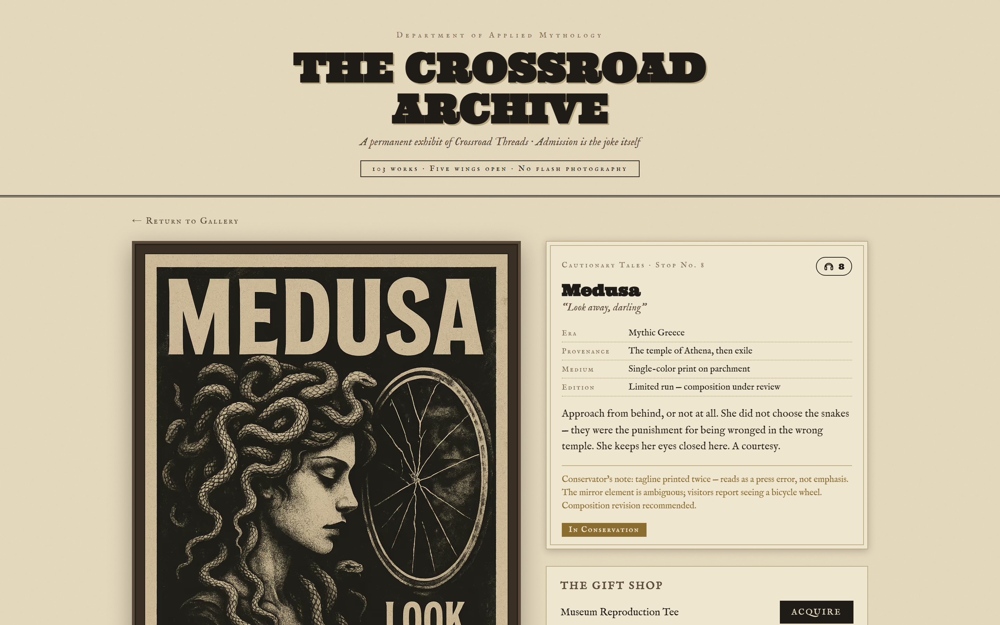
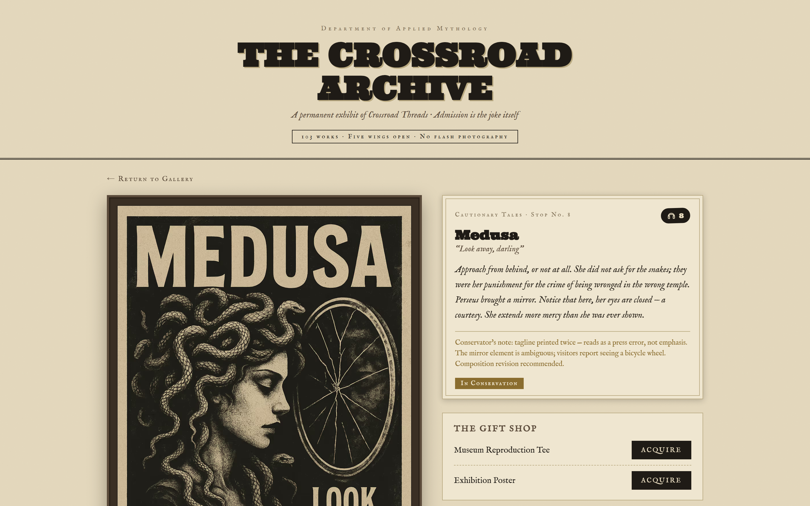
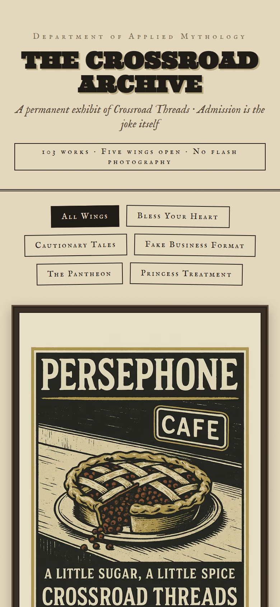

# The Crossroad Archive

**A museum that sells t-shirts. An e-commerce site disguised as a gallery of applied mythology.**

[](https://github.com/dsmcewan/CrossroadThreads/actions/workflows/deploy.yml)
[](https://dsmcewan.github.io/CrossroadThreads/)

**Live: [dsmcewan.github.io/CrossroadThreads](https://dsmcewan.github.io/CrossroadThreads/)**

<p align="center">
  
</p>

Crossroad Threads is an apparel brand where Southern Gothic Americana meets
mythology — "a publishing house that prints on cotton." The storefront leans
all the way into the conceit: every design is an *exhibit*, product categories
are museum *wings*, each shirt gets a curator's placard, a provenance line, a
conservation status, and its own narrated audio-guide stop. The gift shop is
the museum.

This repo turns a single-file React prototype into a production static site:
**103 exhibits, five wings, 103 narrated audio stops, fully static, deployed
from CI to GitHub Pages.**

## The exhibit page

Placard with era / provenance / medium / edition, conservator's notes for
imperfect prints, and a headphones button that plays the audio guide while
showing its transcript.

| Placard | Audio guide playing |
| --- | --- |
|  |  |

## How it works

```
crossroad_imgs/*.png ──┐
                       ├─► scripts/build-catalog.ts ─► catalog.generated.json ─► Next.js static export ─► GitHub Pages
content/designs.json ──┘         │
                                 └─► scripts/image-pipeline.ts (sharp)
                                        AVIF + WebP variants + blur-up placeholders

catalog ─► tts/generate_audio.py (local VITS) ─► public/audio/<slug>.mp3 + manifest
```

### Dynamic catalog with auto-accessioning

The catalog is generated at build time by scanning the image folder and
merging it with curated metadata in [`content/designs.json`](content/designs.json)
(the single editable source of truth). Any image **without** a curated entry
isn't an error — it's automatically accessioned into a "Recent Acquisitions —
Under Study" wing with museum-voice placeholder copy. Drop a new PNG in the
folder and it appears in the gallery on the next build. Curated entries that
reference a missing file fail the build loudly. The merge logic is a pure
function with Vitest coverage.

### Static-export image pipeline

GitHub Pages can't run `next/image`'s optimizer, so the repo has its own:
a sharp-based prebuild step encodes each source PNG into AVIF (q50) and WebP
(q72) at card and full sizes, plus a 20px blur-up placeholder inlined as
base64. Outputs are content-addressed (SHA-1 of the source) so unchanged
images are never re-encoded — locally via `.image-cache.json`, and in CI via
`actions/cache` keyed on the image folder's hash. **330 MB of source PNGs
ship as ~89 MB of derivatives**, served through a hand-rolled `<picture>`
component with `srcset`.

### Perceptual-hash provenance matching

The original prototype embedded 11 designs as base64 thumbnails with finished
copy. The asset library has 103 similarly-named PNGs, including multiple
renditions of the same concepts — filename matching was impossible and visual
matching was ambiguous. Solution: dHash perceptual hashing (16×16 gradient
hash, Hamming distance) between the embedded thumbnails and every source
file. True matches landed at distance ≤ 8 while the nearest non-matches were
≥ 87, so the 11 exhibits with hand-finished copy were re-attached to their
exact source images deterministically.

### Local TTS audio tour

Every exhibit's audio-guide text is synthesized to MP3 with a local VITS
model ([baj-tts](https://github.com/enlyth/baj-tts) via coqui-tts) — 103
narrations, 17 MB total at 64 kbps mono. Synthesis is cached by
`SHA-1(model | text)`, so editing one placard regenerates one file. Text is
normalized first (em-dashes to spoken beats, curly quotes flattened) because
the phonemizer silently drops typography it can't voice. CI doesn't run TTS;
the MP3s are committed and a generated manifest tells the UI which exhibits
get the headphones button. See [`tts/README.md`](tts/README.md) — including
the note that the demo narrator voice is a clone and must be swapped for a
licensed voice before any commercial use.

### GitHub Pages hardening

Project sites live under a subpath, which breaks every naively-rooted asset
URL. All static paths go through one `asset()` helper that applies the
basePath; a post-build verifier (`scripts/verify-export.mjs`) walks the
export and fails if any local URL is missing the prefix, any exhibit page is
missing, or `.nojekyll`/`404.html` are absent. `npm run preview:pages` serves
the export under the real subpath so what you click locally is what deploys.

## Mobile



## Stack

Next.js 15 (App Router, `output: 'export'`) · TypeScript · CSS Modules ·
sharp · Vitest · Playwright (screenshots) · Python VITS TTS · GitHub Actions

## Running it

```bash
npm install
npm run dev        # builds catalog + image derivatives, then next dev
npm test           # catalog merge logic
npm run build      # static export to out/ + post-build verification
npm run preview:pages   # serve out/ under /CrossroadThreads/ like Pages does
```

Audio generation is optional and local-only — setup in [`tts/README.md`](tts/README.md).

Commerce is a provider abstraction currently pointing at a placeholder
("The gift shop is currently being installed. The docents thank you for your
patience."). Wiring up Shopify/Printful/Snipcart later is one provider file.

## License

Code is [MIT](LICENSE). The artwork in `crossroad_imgs/`, the audio
narrations, and all Crossroad Threads brand copy and designs are
**© All rights reserved** — see [LICENSE](LICENSE) for the split.
