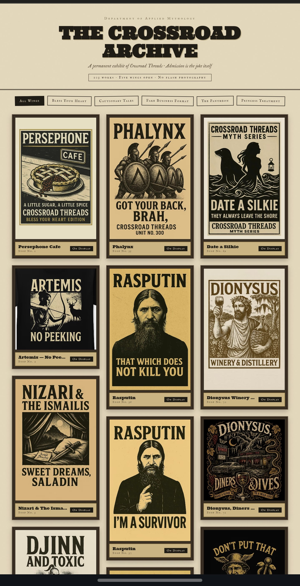
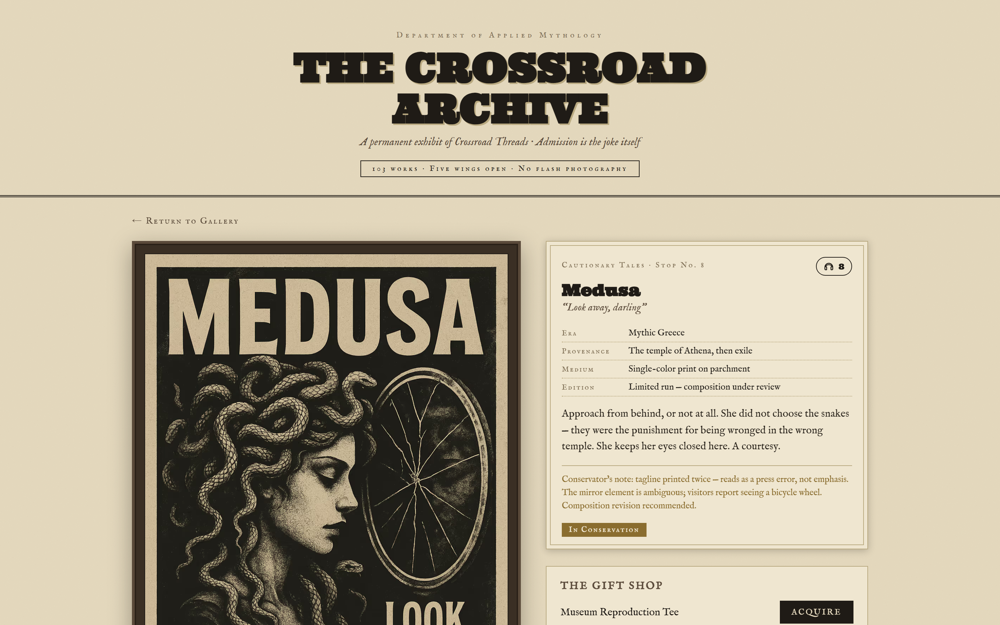
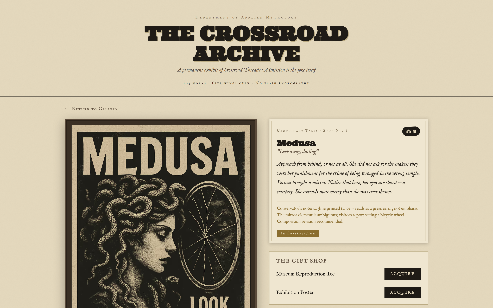
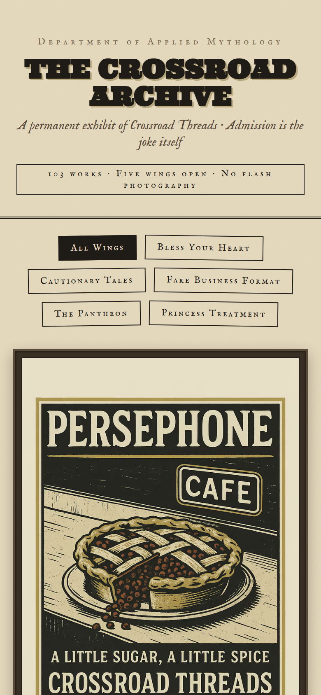

# The Crossroad Archive

**A museum that sells t-shirts. An e-commerce site disguised as a gallery of applied mythology.**

[](https://github.com/dsmcewan/CrossroadThreads/actions/workflows/deploy.yml)
[](https://dsmcewan.github.io/CrossroadThreads/)

**Live:** [dsmcewan.github.io/CrossroadThreads](https://dsmcewan.github.io/CrossroadThreads/)  
**Hiring / engineering review:** [start with `CAREER.md`](CAREER.md)

<p align="center">
  
</p>

Crossroad Threads is an apparel brand where Southern Gothic Americana meets mythology — **a publishing house that prints on cotton**.

The storefront commits to the conceit: every design is an *exhibit*, product categories are museum *wings*, each shirt gets a curator's placard, provenance, conservation status, and its own narrated audio-guide stop. The gift shop is the museum.

This repository turns a single-file React prototype into a production static site: **103 exhibits, five wings, 103 narrated audio stops, fully static, deployed from CI to GitHub Pages.**

## The exhibit page

| Placard | Audio guide playing |
| --- | --- |
|  |  |

Each exhibit combines product information with museum-style metadata, conservator notes, and optional narrated interpretation without requiring a server-side application.

## Build architecture

```text
crossroad_imgs/*.png ──┐
                       ├─► scripts/build-catalog.ts ─► catalog.generated.json ─► Next.js static export ─► GitHub Pages
content/designs.json ──┘         │
                                 └─► scripts/image-pipeline.ts (sharp)
                                        AVIF + WebP variants + blur-up placeholders

catalog ─► tts/generate_audio.py (local VITS) ─► public/audio/<slug>.mp3 + manifest
```

### Dynamic catalog with auto-accessioning

The catalog is generated at build time by scanning the image folder and merging it with curated metadata in [`content/designs.json`](content/designs.json), the single editable source of truth.

An image without a curated entry is automatically accessioned into **Recent Acquisitions — Under Study** with placeholder museum copy. A curated entry that references a missing file fails the build loudly. The merge is implemented as a pure function with Vitest coverage.

### Static-export image pipeline

GitHub Pages cannot run `next/image` optimization, so the repository has its own prebuild pipeline.

`sharp` encodes source PNGs into AVIF and WebP derivatives at card and full sizes plus a 20px blur-up placeholder. Outputs are content-addressed using the source hash, so unchanged images are not re-encoded locally or in CI.

**~330 MB of source PNGs ship as ~89 MB of derivatives**, served through a custom `<picture>` component with responsive `srcset`.

### Perceptual-hash provenance matching

The original prototype embedded 11 finished designs as base64 thumbnails. The asset library later contained 103 similarly named source images, including multiple variants of the same concepts, making filename matching unreliable.

The project uses **dHash perceptual hashing + Hamming distance** to match each embedded thumbnail back to its correct source file. True matches landed at distance ≤ 8 while the nearest non-matches were ≥ 87, allowing the finished copy to be reattached deterministically rather than by manual guesswork.

### Local TTS audio tour

Each exhibit's audio-guide text can be synthesized locally to MP3 using a VITS pipeline. Synthesis is cached by `SHA-1(model | text)`, so changing one placard regenerates one file.

Text is normalized before synthesis because some typography is silently dropped by the phonemizer. CI does not run TTS; committed audio files are exposed through a generated manifest consumed by the frontend.

See [`tts/README.md`](tts/README.md). The demo narrator voice must be replaced with a properly licensed voice before commercial use.

### GitHub Pages hardening

Project sites live under a subpath, which breaks naive root-relative URLs.

All local static paths go through one `asset()` helper that applies the configured base path. A post-build verifier in `scripts/verify-export.mjs` walks the export and fails if:

- a local URL is missing the required prefix
- an exhibit page is missing
- `.nojekyll` is missing
- `404.html` is missing

`npm run preview:pages` serves the export under the real `/CrossroadThreads/` subpath so local verification matches the hosting environment.

## Mobile



## Stack

Next.js 15 (App Router, `output: 'export'`) · React · TypeScript · CSS Modules · sharp · Vitest · Playwright · Python VITS TTS · GitHub Actions

## Run locally

```bash
npm install
npm run dev             # catalog + image derivatives + dev server
npm test                # catalog merge tests
npm run build           # static export + post-build verification
npm run preview:pages   # preview under the real GitHub Pages subpath
```

Audio generation is optional and local-only; setup lives in [`tts/README.md`](tts/README.md).

Commerce is currently isolated behind a provider abstraction with a placeholder implementation, so a later Shopify/Printful/Snipcart integration does not need to reshape the catalog or presentation layer.

## Engineering review

For the short employment-facing walkthrough, see [`CAREER.md`](CAREER.md). It highlights the product-incubation, frontend, content-pipeline, media, deterministic matching, and deployment work represented here.

## Colophon

Drason McEwan created the product concept, brand direction, content system, and architecture. AI coding collaborators assisted with implementation and iteration.

## License

Code is [MIT](LICENSE). The artwork in `crossroad_imgs/`, audio narrations, brand copy, and Crossroad Threads designs are **© All rights reserved** — see [LICENSE](LICENSE) for the split.
